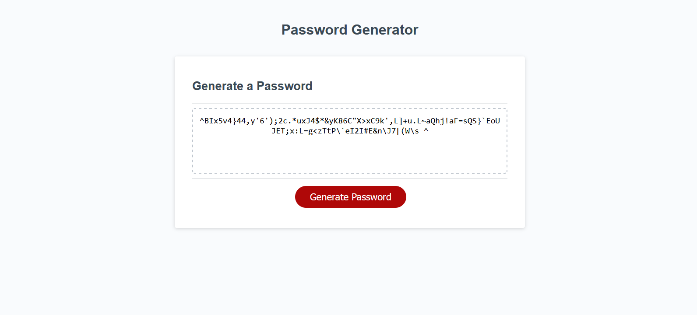

# PasswordGenerator
Implementing a password generating website with vanilla Javascript.

## Small Disclaimer
Just because a character option is selected does not necesarilly mean it will appear in the password, as all are generated randomly. Guarenteeing minimum character inclusion could be a desired feature, but it is not currently implemented as such.

## Link
The project can be found here [on my github.io](https://reidmadock.github.io/PasswordGenerator/)

## Screenshots
This is what the site looks like with a 99 character screenshot generated.

